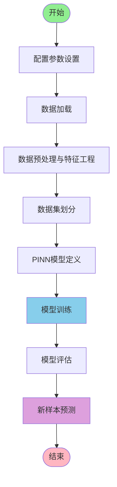
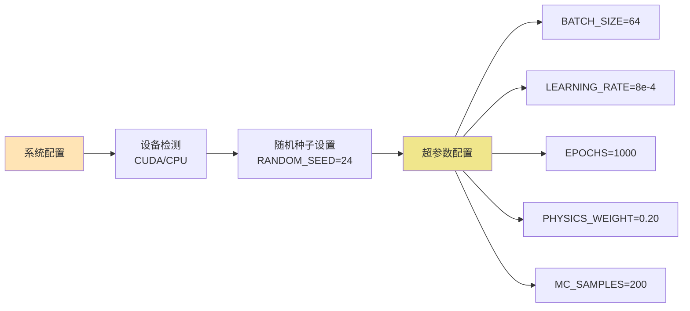
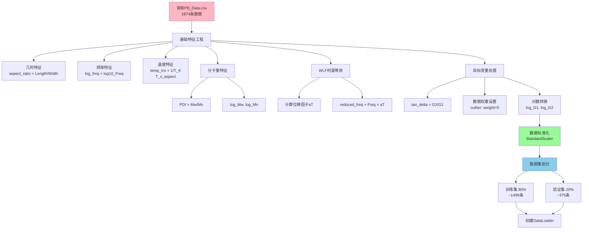
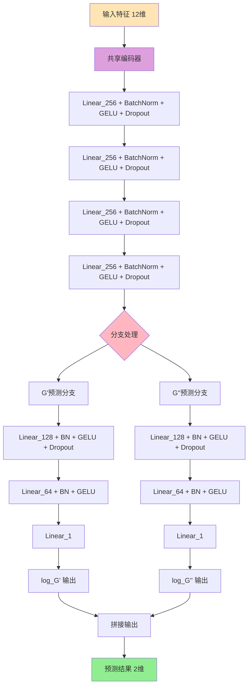
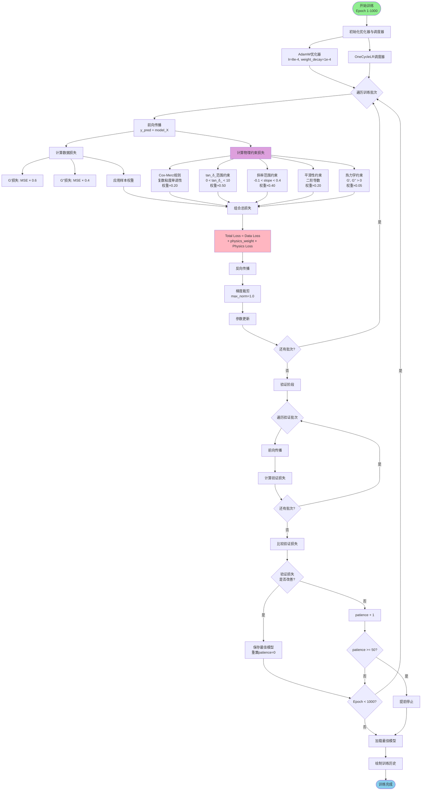
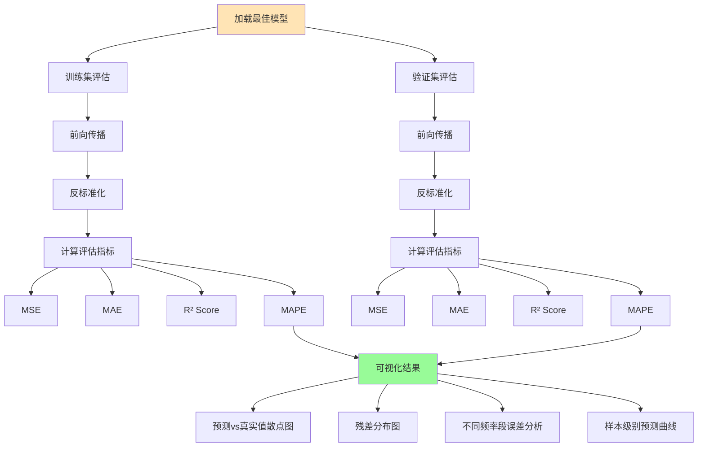
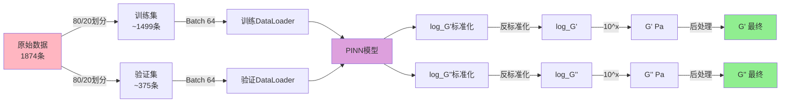
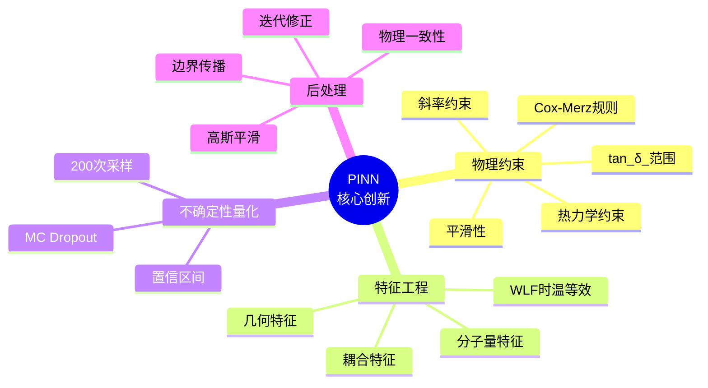
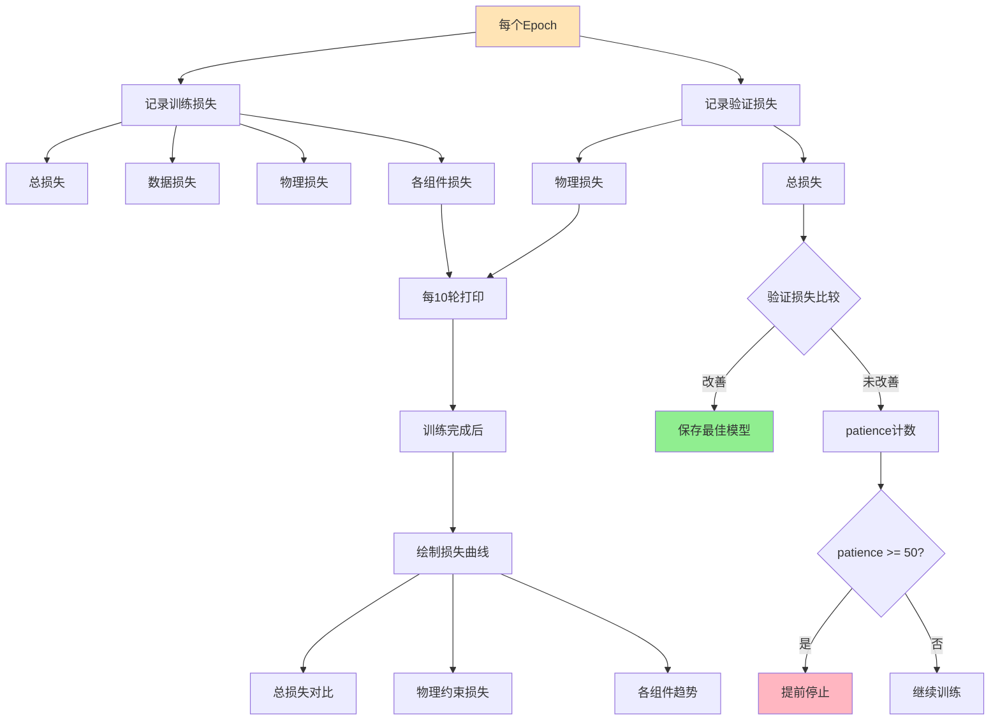

# PINN流变性能预测系统 - 完整流程图

## 📊 整体架构流程



---

## 🔧 详细流程图

### 1️⃣ 配置与初始化阶段



**关键参数说明：**
- 训练集：80% (~1499条)
- 验证集：20% (~375条)
- 最大训练轮数：1000轮
- 提前停止耐心值：50轮

---

### 2️⃣ 数据处理流程



**特征列表（12个特征）：**
1. Length_nm
2. Width_nm
3. aspect_ratio
4. Temp_C
5. log_freq
6. temp_inv
7. T_x_aspect
8. aT
9. log_Mw
10. log_Mn
11. PDI
12. log_c

---

### 3️⃣ PINN模型架构



**模型特点：**
- 深层共享编码器（4层×256神经元）
- 双分支结构（G' 和 G'' 独立预测）
- BatchNorm + GELU 激活函数
- Dropout (rate=0.05) 用于不确定性量化

---

### 4️⃣ 训练流程（核心）



**损失函数组成：**
1. **数据损失**：0.6×MSE(G') + 0.4×MSE(G'')
2. **物理约束损失**（5个组件）：
   - Cox-Merz规则 (20%)
   - tan(δ)范围 (50%)
   - 斜率范围 (40%)
   - 平滑性 (20%)
   - 热力学 (5%)

---

### 5️⃣ 模型评估流程



---

### 6️⃣ 预测与后处理流程

```mermaid
flowchart TD
    Start[新样本数据] --> FE[特征工程]
    
    FE --> FE1[几何特征]
    FE --> FE2[温度特征]
    FE --> FE3[WLF特征]
    FE --> FE4[分子量特征]
    
    FE1 --> Std[特征标准化]
    FE2 --> Std
    FE3 --> Std
    FE4 --> Std
    
    Std --> Pred{预测模式}
    
    Pred -->|带不确定性| MC[Monte Carlo Dropout]
    Pred -->|不带不确定性| Simple[简单预测]
    
    MC --> MC1[启用Dropout]
    MC1 --> MC2[重复预测200次]
    MC2 --> MC3[计算均值和标准差]
    MC3 --> MC4[构建置信区间<br/>95% CI]
    
    Simple --> S1[单次预测]
    
    MC4 --> Inverse[反标准化]
    S1 --> Inverse
    
    Inverse --> I1[对数空间 → 线性空间<br/>10^log_G]
    I1 --> I2[计算tan_δ_]
    
    I2 --> PostProcess[物理一致性后处理]
    
    PostProcess --> PP1[按频率排序]
    PP1 --> PP2[对数空间操作]
    
    PP2 --> PP3[高斯平滑<br/>σ=1.0]
    PP3 --> PP4[斜率裁剪<br/>[-0.1, 0.4]]
    PP4 --> PP5[迭代修正3次]
    
    PP5 --> PP6[tan_δ_约束<br/>clip_0, 10]
    PP6 --> PP7[从G'和tan_δ_<br/>重建G'']
    
    PP7 --> PP8[高频区域<br/>额外平滑]
    PP8 --> PP9[Cox-Merz规则<br/>修正]
    
    PP9 --> PP10{有不确定性?}
    PP10 -->|是| UC[更新置信区间]
    PP10 -->|否| Output
    
    UC --> UC1[保持相对不确定性]
    UC1 --> UC2[对边界平滑]
    UC2 --> UC3[确保边界包含预测值]
    
    UC3 --> Output[输出结果]
    
    Output --> Viz[可视化]
    Viz --> V1[G', G'' vs 频率]
    Viz --> V2[tan_δ_ vs 频率]
    Viz --> V3[Cole-Cole图]
    
    style Start fill:#FFE4B5
    style PostProcess fill:#DDA0DD
    style Output fill:#90EE90
```

**后处理关键步骤：**
1. **平滑处理**：高斯滤波去噪
2. **斜率约束**：限制变化速率
3. **物理约束**：tan(δ)范围
4. **一致性修正**：Cox-Merz规则
5. **不确定性传播**：保持置信区间

---

## 📈 数据流向图



---

## 🎯 核心创新点



---

## 📊 性能监控流程



---

## 🔍 完整系统总结

| 模块 | 输入 | 输出 | 关键技术 |
|------|------|------|----------|
| **数据处理** | PB_Data.csv | 标准化特征矩阵 | 特征工程、WLF、标准化 |
| **模型架构** | 12维特征 | 2维预测(log_G', log_G'') | 深层编码器、双分支 |
| **训练** | 训练/验证集 | 最佳模型权重 | 物理约束、动态权重、提前停止 |
| **预测** | 新样本 | G', G'', 不确定性 | MC Dropout、后处理 |
| **可视化** | 预测结果 | 多种图表 | 散点图、Cole-Cole图 |

**系统优势：**
✅ 结合物理知识和数据驱动  
✅ 提供预测不确定性  
✅ 自动物理一致性修正  
✅ 完整的训练监控  
✅ 稳健的优化策略  

**实际表现：**
- 训练集：~1499条
- 验证集：~375条
- 训练轮数：1000轮（完整）
- 收敛情况：持续改进，未提前停止
