# PINN Rheology Prediction System - Complete Flowchart

## 📊 Overall Architecture Flow


---

## 🔧 Detailed Flowcharts

### 1️⃣ Configuration & Initialization Phase


**Key Parameters:**
- Training set: 80% (~1499 samples)
- Validation set: 20% (~375 samples)
- Max training epochs: 1000
- Early stopping patience: 50 epochs

---

### 2️⃣ Data Processing Flow


**Feature List (12 features):**
1. Length_nm
2. Width_nm
3. aspect_ratio
4. Temp_C
5. log_freq
6. temp_inv
7. T_x_aspect
8. aT
9. log_Mw
10. log_Mn
11. PDI
12. log_c

---

### 3️⃣ PINN Model Architecture


**Model Features:**
- Deep shared encoder (4 layers × 256 neurons)
- Dual-branch architecture (G' and G'' independent prediction)
- BatchNorm + GELU activation function
- Dropout (rate=0.05) for uncertainty quantification

---

### 4️⃣ Training Flow (Core)


**Loss Function Components:**
1. **Data Loss**: 0.6×MSE(G') + 0.4×MSE(G'')
2. **Physics Constraint Loss** (5 components):
   - Cox-Merz Rule (20%)
   - tan(δ) Range (50%)
   - Slope Range (40%)
   - Smoothness (20%)
   - Thermodynamics (5%)

---

### 5️⃣ Model Evaluation Flow

```mermaid
flowchart TD
    A[Load Best Model] --> B[Training Set Evaluation]
    A --> C[Validation Set Evaluation]
    
    B --> B1[Forward Pass]
    C --> C1[Forward Pass]
    
    B1 --> B2[Inverse Transform]
    C1 --> C2[Inverse Transform]
    
    B2 --> B3[Calculate Evaluation Metrics]
    C2 --> C3[Calculate Evaluation Metrics]
    
    B3 --> M1[MSE]
    B3 --> M2[MAE]
    B3 --> M3[R² Score]
    B3 --> M4[MAPE]
    
    C3 --> M5[MSE]
    C3 --> M6[MAE]
    C3 --> M7[R² Score]
    C3 --> M8[MAPE]
    
    M4 --> V1[Visualization Results]
    M8 --> V1
    
    V1 --> V1_1[Prediction vs True Scatter Plot]
    V1 --> V1_2[Residual Distribution]
    V1 --> V1_3[Error Analysis by Frequency Range]
    V1 --> V1_4[Sample-level Prediction Curves]
    
    style A fill:#FFE4B5
    style V1 fill:#98FB98
```



---

### 6️⃣ Prediction & Post-processing Flow

```mermaid
flowchart TD
    Start[New Sample Data] --> FE[Feature Engineering]
    
    FE --> FE1[Geometric Features]
    FE --> FE2[Temperature Features]
    FE --> FE3[WLF Features]
    FE --> FE4[Molecular Weight Features]
    
    FE1 --> Std[Feature Standardization]
    FE2 --> Std
    FE3 --> Std
    FE4 --> Std
    
    Std --> Pred{Prediction Mode}
    
    Pred -->|With Uncertainty| MC[Monte Carlo Dropout]
    Pred -->|Without Uncertainty| Simple[Simple Prediction]
    
    MC --> MC1[Enable Dropout]
    MC1 --> MC2[Repeat Prediction 200 Times]
    MC2 --> MC3[Calculate Mean & Std]
    MC3 --> MC4[Build Confidence Interval<br/>95% CI]
    
    Simple --> S1[Single Prediction]
    
    MC4 --> Inverse[Inverse Transform]
    S1 --> Inverse
    
    Inverse --> I1[Log Space → Linear Space<br/>10^log_G]
    I1 --> I2[Calculate tan_δ_]
    
    I2 --> PostProcess[Physical Consistency Post-processing]
    
    PostProcess --> PP1[Sort by Frequency]
    PP1 --> PP2[Log Space Operation]
    
    PP2 --> PP3[Gaussian Smoothing<br/>σ=1.0]
    PP3 --> PP4[Slope Clipping<br/>[-0.1, 0.4]]
    PP4 --> PP5[Iterative Correction 3x]
    
    PP5 --> PP6[tan_δ_ Constraint<br/>clip_0, 10]
    PP6 --> PP7[Reconstruct G'' from<br/>G' and tan_δ_]
    
    PP7 --> PP8[High Frequency Region<br/>Extra Smoothing]
    PP8 --> PP9[Cox-Merz Rule<br/>Correction]
    
    PP9 --> PP10{Has Uncertainty?}
    PP10 -->|Yes| UC[Update Confidence Interval]
    PP10 -->|No| Output
    
    UC --> UC1[Maintain Relative Uncertainty]
    UC1 --> UC2[Smooth Boundaries]
    UC2 --> UC3[Ensure Bounds Contain Prediction]
    
    UC3 --> Output[Output Results]
    
    Output --> Viz[Visualization]
    Viz --> V1[G', G'' vs Frequency]
    Viz --> V2[tan_δ_ vs Frequency]
    Viz --> V3[Cole-Cole Plot]
    
    style Start fill:#FFE4B5
    style PostProcess fill:#DDA0DD
    style Output fill:#90EE90
```

**Key Post-processing Steps:**
1. **Smoothing**: Gaussian filtering for noise reduction
2. **Slope Constraint**: Limit rate of change
3. **Physical Constraint**: tan(δ) range
4. **Consistency Correction**: Cox-Merz rule
5. **Uncertainty Propagation**: Maintain confidence intervals

---

## 📈 Data Flow Diagram


---

## 🎯 Core Innovations

```mermaid
mindmap
    root((PINN<br/>Core Innovations))
        Physics Constraints
            Cox-Merz Rule
            tan_δ_ Range
            Slope Constraint
            Smoothness
            Thermodynamic Constraint
        Feature Engineering
            WLF Time-Temperature
            Molecular Weight Features
            Geometric Features
            Coupled Features
        Uncertainty Quantification
            MC Dropout
            200 Samples
            Confidence Intervals
        Post-processing
            Physical Consistency
            Gaussian Smoothing
            Iterative Correction
            Boundary Propagation
```



---

## 📊 Performance Monitoring Flow


---

## 🔍 Complete System Summary

| Module | Input | Output | Key Technologies |
|--------|-------|--------|------------------|
| **Data Processing** | PB_Data.csv | Standardized Feature Matrix | Feature Engineering, WLF, Standardization |
| **Model Architecture** | 12D Features | 2D Prediction (log_G', log_G'') | Deep Encoder, Dual-branch |
| **Training** | Train/Val Sets | Best Model Weights | Physics Constraints, Dynamic Weights, Early Stopping |
| **Prediction** | New Samples | G', G'', Uncertainty | MC Dropout, Post-processing |
| **Visualization** | Prediction Results | Various Plots | Scatter Plots, Cole-Cole Plots |

**System Advantages:**
✅ Combines physics knowledge with data-driven approach  
✅ Provides prediction uncertainty  
✅ Automatic physical consistency correction  
✅ Complete training monitoring  
✅ Robust optimization strategy  

**Actual Performance:**
- Training set: ~1499 samples
- Validation set: ~375 samples
- Training epochs: 1000 (complete)
- Convergence: Continuous improvement, no early stopping
